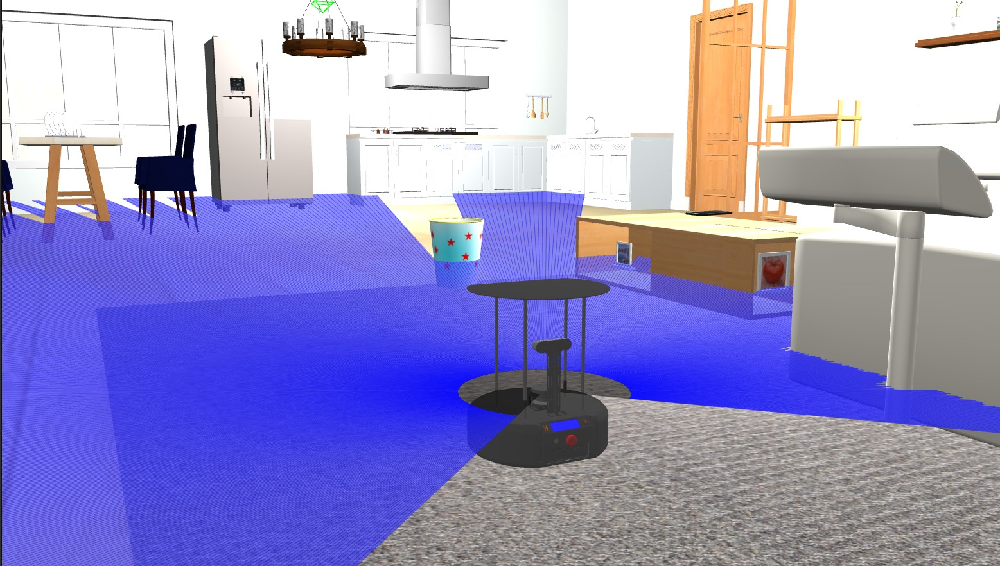
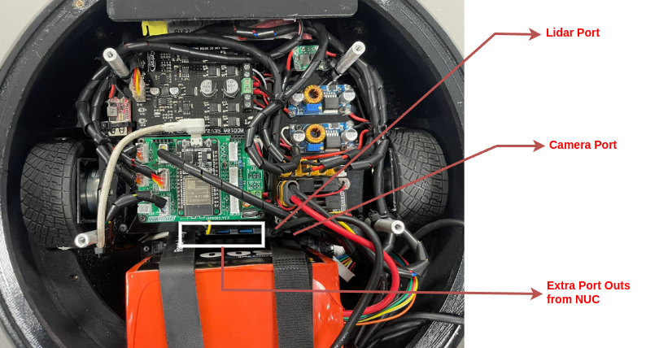

# Tortoisebot Pro-MAX 
## ROS2 Galactic Release


<div align="center">

Welcome to the official public repository for **TortoisebotProMax** by **RigBetel Labs**.

**Purpose:**  
This repository hosts essential documentation and code for *TortoisebotProMax Robot*, facilitating transparency and collaboration.

**Privacy:**  
Certain sensitive packages and scripts have been excluded to maintain privacy standards.

**Contents:**  
- **Documentation:** Detailed guides and technical specifications.
- **Codebase:** Essential source code for *TortoisebotProMax Robot*.
- **Resources:** Supplementary materials and dependencies.


**Contact:**  
For inquiries and collaboration opportunities, reach out to RigBetel Labs.


<a href="https://rigbetellabs.com/"></a>
<a href="https://www.youtube.com/channel/UCfIX89y8OvDIbEFZAAciHEA"></a>
<a href="https://www.instagram.com/rigbetellabs/"></a>


</div>

--- 

## Table of Contents
- [**1. Package Description**](#1-package-description)
   - [**1.1 tortoisebotpromax_description**](#11-tortoisebotpromax_description)
   - [**1.2 tortoisebotpromax_firmware**](#12-tortoisebotpromax_firmware)
   - [**1.3 tortoisebotpromax_gazebo**](#13-tortoisebotpromax_gazebo)
   - [**1.4 tortoisebotpromax_navigation**](#14-tortoisebotpromax_navigation)
   - [**1.5 tortoisebotpromax_bringup**](#15-tortoisebotpromax_bringup)
   - [**1.6 tortoisebotpromax_slam**](#16-tortoisebotpromax_slam)
- [**2. Simulation**](#2-simulation)
- [**3. Real Robot**](#3-real-robot)
- [**4. Launch Sequence**](#4-launch-sequence)
   - [**4.1 Map Generation**](#41-map-generation)
   - [**4.2 Autonomous Navigation**](#42-autonomous-navigation-in-the-saved-map)
   - [**4.3 Visualizing in remote PC**](#43-visualizing-in-remote-pc)
- [**5. Features via ROS Topics**](#5-features-via-ros-topics)
- [**6. Tortoisebot Pro Max Robot Parameters**](#6-tortoisebotpromax-robot-parameters)
- [**7. Diagnostic Tests**](#7-diagnostic-tests)
- [**8. USB Port Configuration**](#8-usb-ports-configuration)


## 1. Package Description

### 1.1 tortoisebotpromax_description

Holds the robot description including URDF, STL, config files for RVIZ, and Gazebo.

| File               | Description                                 | Nodes Launched                    |
|--------------------|---------------------------------------------|-----------------------------------|
| [display.launch.py](https://github.com/rigbetellabs/tortoisebot_pro_max/blob/ros2-galactic/tortoisebotpromax_description/launch/display.launch.py)         | Launches Gazebo simulation with all necessary plugins and state publishers, along with RViz.                                                                                                                                     | robot_state_publisher, joint_state_publisher, rviz2, gazebo_ros                     |
|[rviz.launch.py](https://github.com/rigbetellabs/tortoisebot_pro_max/blob/ros2-galactic/tortoisebotpromax_description/launch/rviz.launch.py)           | Launches RViz2 with necessary configuration.                                                                                                                                                                                      | rviz2 with configured settings                                                         |
| [state_publisher.launch.py](https://github.com/rigbetellabs/tortoisebot_pro_max/blob/ros2-galactic/tortoisebotpromax_description/launch/state_publisher.launch.py) | Launches state publishers for the robot, including robot_state_publisher and joint_state_publisher nodes.                                                                                                                                                                                         | robot_state_publisher, joint_state_publisher                                            |


### 1.2 tortoisebotpromax_firmware

Provides sensor and actuation topics.

| File                | Description                                             | Nodes Launched                |
|---------------------|---------------------------------------------------------|-------------------------------|
| [auto_joy_teleop.launch.py](https://github.com/rigbetellabs/tortoisebot_pro_max/blob/ros2-galactic/tortoisebotpromax_firmware/launch/auto_joy_teleop.launch.py) | Launches the joy node and auto joy node for complete joystick and waypoint-based control of the robot using a joystick.                                                                                  | joy_node, auto_joy_teleop                   |
| [hubble_scripts.launch.py](https://github.com/rigbetellabs/tortoisebot_pro_max/blob/ros2-galactic/tortoisebotpromax_firmware/launch/hubble_scripts.launch.py)  | Provides feedback to the controller about network data and navigation data, including network_pub node and goal_status_publisher node.                                                              | network_publisher (freezed binaries), goal_status_publisher (freezed binaries) | |
| [realsense_d435i.launch.py](https://github.com/rigbetellabs/tortoisebot_pro_max/blob/ros2-galactic/tortoisebotpromax_firmware/launch/realsense_d435i.launch.py)   | Launches ROS 2 Realsense packages with point cloud enabling.|ROS 2 Realsense packages
| [micro_ros.launch.py](https://github.com/rigbetellabs/tortoisebot_pro_max/blob/ros2-galactic/tortoisebotpromax_firmware/launch/micro_ros.launch.py)   | Launches MicroROS                                                                                                                                      | Micro ROS                 |
### 1.3 tortoisebotpromax_gazebo
Simulation environment for tortoisebotpromax in Gazebo.

| File                | Description                                             | Nodes Launched                |
|---------------------|---------------------------------------------------------|-------------------------------|
|  [gazebo.launch.py](https://github.com/rigbetellabs/tortoisebot_pro_max/blob/ros2-galactic/tortoisebotpromax_gazebo/launch/gazebo.launch.py)      | Launches a Gazebo environment with a specified world, along with the gazebo_ros node.                                    | gazebo_ros node                                         |
|  [spawn_robot.launch.py](https://github.com/rigbetellabs/tortoisebot_pro_max/blob/ros2-galactic/tortoisebotpromax_gazebo/launch/gazebo.launch.py) | Launches a Gazebo environment with a specified world and spawns the robot with necessary plugins using gazebo_ros node. | gazebo_ros node, robot_state_publisher, joint_state_publisher, gazebo_controllers |

### 1.4 tortoisebotpromax_navigation
Autonomous navigation of the robot using `move_base` in a known as well as an unknown environment.

| File                         | Description                              | Nodes Launched                              |
|------------------------------|------------------------------------------|------------------------------------------------------|
| [navigation.launch.py](https://github.com/rigbetellabs/tortoisebot_pro_max/blob/ros2-galactic/tortoisebotpromax_navigation/launch/navigation.launch.py)| Launches all the necessary nodes for Nav2-based robot navigation with the necessary parameters for the specified robot.                                 | Nav2 navigation nodes (e.g., planner, controller, recovery nodes) with specified parameters. |
| [map_saver.launch.py](https://github.com/rigbetellabs/tortoisebot_pro_max/blob/ros2-galactic/tortoisebotpromax_navigation/launch/map_saver.launch.py) | Saves the map created during exploration mode to the maps directory.                                                                                        | map_saver node |

### 1.5 tortoisebotpromax_bringup
| File       | Description                                                                                                                   |
|------------------------|---------------------------------------------------------------------------------------------------------------------------------------------------------------------------------------------------------------------------------|
| [autobringup.launch.py](https://github.com/rigbetellabs/tortoisebot_pro_max/blob/ros2-galactic/tortoisebotpromax_bringup/launch/autobringup.launch.py)   | Launches the whole autonomous suite, including navigation, exploration, localization, LiDAR packages, RealSense packages, MicroROS(launched separately), simulation, state publisher, RViz, and Hubble scripts.                                 |
| [bringup.launch.py](https://github.com/rigbetellabs/tortoisebot_pro_max/blob/ros2-galactic/tortoisebotpromax_bringup/launch/bringup.launch.py)       | Brings up all the sensors and hardware components on the robot, MicroROS(launched separately), LiDAR, RealSense, and Hubble scripts.                                                                                                    |
### 1.6 tortoisebotpromax_slam
Simultaneous Localization and Mapping (SLAM) for the robot.

| File                    | Description                                             | Additional Information                          |
|-------------------------|---------------------------------------------------------|--------------------------------------------------|
| [cartographer.launch.py](https://github.com/rigbetellabs/tortoisebot_pro_max/blob/ros2-galactic/tortoisebotpromax_slam/launch/cartographer.launch.py)  | Launches the Cartographer node for SLAM and localization tasks.                                                                         | Cartographer node                        |
| [slam_toolbox.launch.py](https://github.com/rigbetellabs/tortoisebot_pro_max/blob/ros2-galactic/tortoisebotpromax_slam/launch/slam_toolbox.launch.py)  | Launches the SLAM Toolbox for performing SLAM in unknown environments.                                                                  | SLAM Toolbox node                       |


## 2. Simulation
For simulation, below process needs to be done in laptop/PC with ROS2 Galactic installed in it.

Lets first source the models necessary for visualzing the simulation world
```bash
cd ~ 
git clone -b ros2 https://github.com/aws-robotics/aws-robomaker-small-house-world.git
```
Now direct your Gazebo Model Path to the following directory:
```
echo 'export GAZEBO_MODEL_PATH=~/aws-robomaker-small-house-world/models:$GAZEBO_MODEL_PATH' >> ~/.bashrc

source ~/.bashrc
```

Now clone the TTB-ProMax repository into your workspace:
```bash
cd ~/ros2_ws/src  # Assuming ros2_ws is the name of the workspace
git clone -b ros2-galactic https://github.com/rigbetellabs/tortoisebot_pro_max.git
```

Install dependent packages:

```bash
cd ~/ros2_ws/src/tortoisebot_pro_max
cat requirements.txt | xargs sudo apt-get install -y 
```

> [!NOTE]
> Custom joystick control script currently runs on the robot, enabling waypoint storage and navigation through joy buttons. This node can be accessed on:

```bash
cd ~/ros2_ws/src/
git clone -b ros2-galactic https://github.com/rigbetellabs/joy_with_waypoint_nav.git
```

Build the workspace:

```bash
cd ~/ros2_ws
colcon build
```  

To Launch simulation:
```bash
ros2 launch tortoisebotpromax_bringup autobringup.launch.py use_sim_time:=True
```
>[!NOTE] bringup.launch.py can not be launched in simulation as it is robot specific launch file to bringup all the sensors and hardware components on the robot.

The gazebo world looks like this:




## 3. Real Robot

### Modes of robot.
There are two modes of robot 
#### 1. Demo Mode - ROS is running on the robot.
#### 2. Development Mode - No ROS node is running on the robot.

>By default, When robot is switched on for first time once it is delivered to you, the robot is programmed to be started up automatically in demo mode ,with its ros running without the need for any wifi network.

>During demo mode, robot can do autonomous navigation using joystick.  Refer below image to understand the working of joystick.


>As robot is currently  not connected with any WiFi, We can not perform SSH, visualize it in rviz or  switch it to development mode. For us to do all that we need to follow the process of initial WiFi setup.

### Initial Wifi Setup

Follow the steps below to connect the robot to your desired Wifi network
#### 1. Create a mobile hotspot
Initiate a hotspot from your smartphone/laptop with the credentials
- Hotspot Name:  `admin`
- Hotspot Password: `adminadmin`

<p align="center">

</p>

#### 2. Start the robot
Power on the robot and wait until it connects to your hotspot network

| On powering on:            | When connected to hotspot:                               | 
|--------------------|---------------------------------------------|
|    |    |

#### 3. SSH into the robot

- Connect your laptop/remote device to the same hotspot
<p align="center">

</p>

- Open a new terminal, and enter the SSH credentials
```bash
# Method 1-ssh using user name 
ssh ttb-promax@192.168.51.102  
pwd: "rbl@2020"

#Method 2 -ssh using ip address 
ssh ttb-promax@rigbetellabs.local  
pwd: "rbl@2020"
```
> [!TIP]
> IP can be seen on the display of robot once connected with WiFi


| Method1           | Method2                            | 
|--------------------|---------------------------------------------|
|    |     |

#### 4. Connect to Wifi

- Enter the following command on the ssh terminal to check available networks
```bash
sudo nmcli dev wifi list --rescan yes
```
 

- Connect to your wifi network
```bash
sudo nmcli device wifi connect "your-wifi-name" password "your-wifi-password"
```
 

> [!IMPORTANT]
> This will close the ssh pipeline and no response will be recieved over it further. Wait for about 30 seconds for robot to be connected to your wifi, once connected it will show the wifi name along with the IP address on the robot display.

#### 4. SSH using your Wifi
- Now the robot is connected to your Wifi network! You can now shutdown your mobile hotspot, connect your remove device to the same wifi and access the robot using SSH:

 


## 4. Launch Sequence
### Switching mode in robot
> [!NOTE]
> By default, the robot is programmed to be started up automatically in demo mode, with its ros running on robot without the need for any wifi network. To get into the development mode of the robot, ssh into the robot and run

```bash
cd ros2_ws/src/tortoisebot_pro_max
./development.sh
```
> [!NOTE]
This will stop all the running ros processes permanently on the robot  and allowing you to test your launch files accordingly. If you need the robot to  upstart i.e. (Starting desired ROS processes automatically on boot) use the below command to start demo mode 
```bash
cd ros2_ws/src/tortoisebot_pro_max
./demo.sh
```


### Real Robot
> [!NOTE]
>Make sure you are in development mode before manually launching the following scripts)
For complete startup of the robot with all its features and autonomous navigation:

```bash
ros2 launch tortoisebotpromax_bringup autobringup.launch.py 
```
Other Arguments to play with:
| Argument      | Description                                                                                                                                                   | Default Value |
|---------------|---------------------------------------------------------------------------------------------------------------------------------------------------------------|---------------|
| use_sim_time  | Set to True for Gazebo simulation, False for real robot.                                                                                                     | False         |
| joy           | Set to True to enable joystick control.                                                                                                                      | True          |
| map_file      | Provide the directory path to launch the robot on a specified map (works only when exploration is set to False).                                             | None          |
| exploration   | Set to True for SLAM and false for map-based navigation.                                                                                                      | True          |
| realsense     | Set to True to launch the RealSense camera.                                                                                                                   | True          |
___________

To launch only sensors and actuators without navigation and odometry:
```bash
ros2 launch tortoisebotpromax_bringup bringup.launch.py
```

### 4.1 Map Generation

```bash
ros2 launch tortoisebotpromax_bringup autobringup.launch exploration:=True
```
>This will ensure all the necessary nodes are up for SLAM based navigation on the robot.

To save the map:

```bash
ros2 launch tortoisebotpromax_navigation map_saver.launch.py map_file_path:=/your/map/directory
```

### 4.2 Autonomous Navigation in the Saved Map

Using Cartographer:
```bash
ros2 launch tortoisebotpromax_bringup autobringup.launch exploration:=False map_file:=/your/map/directory
```

### 4.3 Visualizing in remote PC
ROS domain id for robot is set to 169. So to visualize robot ros topics in remote PC we need to enter below command in terminal of remote pc everytime we open a new terminal.

```bash
export ROS_DOMAIN_ID=169
```

## 5. Features via ROS Topics

#### `/battery/percentage`
This topic provides information about the remaining battery percentage of the robot. 

| Battery Percentage  | Beeping Sounds              |
|----------------------|-----------------------------|
| 100 - 20            | No beeping                  |
| 20 - 15              | Beep every 2 minutes        |
| 15 - 10              | Beep every 1 minute        |
| Below 10             | Very frequent beeping      |
| 0 (Complete Discharge)| Continuous beep             |

> [!TIP]
> To ensure you are aware of the robot's battery status, pay attention to the beeping sounds, especially as the battery percentage decreases.

> [!CAUTION]
> Do not drain the battery below `10 %`, doing so can damage the battery permanently.

#### `/battery/voltage`
This topic reports the current battery voltage, ranging from 25.2V at maximum charge to 19.8V at minimum charge.

#### `/cmd_vel`
The `/cmd_vel` topic is responsible for receiving velocity commands for the robot. These commands can be generated by teleoperation or the `move_base` module, instructing the robot on how fast to move in different directions.

#### `/pid/control`
This topic is of type `int` and is used to control the Proportional-Integral-Derivative (PID) controller. Publishing `0` stops PID control, `1` starts fast PID control, `2` activates smooth PID control, `3` activate supersmooth PID control.
Here's an example:
```bash
ros2 topic pub -1 /pid/control std_msgs/Int32 "data: 1"
```
#### `/diagnostics/test`
The `/diagnostics/test` topic is utilized to run diagnostics on the robot. It serves the purpose of identifying and addressing any issues that may arise during the robot's operation. For detailed diagnostics procedures, refer to the documentation.

#### `/wheel/ticks`
This topic provides an array of ticks for all four wheels of the robot, in the format `[left wheel right wheel]`. These values represent the encoder readings of the wheel ticks.

#### `/wheel/vel`
The `/wheel/vel` topic sends an array of calculated velocities for each wheel on the robot, received via encoders. The format of the array is `[left wheel right wheel]`, representing the actual velocity at which each wheel is moving.

#### `/hill_hold_control`
The `/hill_hold_control` topic when enabled (It can be enabled by publishing true on `/hill_hold_control` topic) holds the robot on slope without any user input.

 

## 6. Tortoisebot ProMax Robot Parameters

| Parameter                   | Value                                     |
|-----------------------------|-------------------------------------------|
| **Wheels Type**             | Differential Wheels                       |
| **Diameter**                | 0.079m                                      |
| **Wheel Separation**        | 0.257m                                      |
| **Motor Type**              | Planetary DC Geared Motor                 |
| **RPM**                     | 112                                       |
| **Encoder Type**            | Magnetic Encoder                          |
| **PPR (Pulses Per Revolution)**| 618.75                                     |
| **Microcontroller**         | DOIT-ESP32 Devkit V1                      |
| **PC Used**                 | Intel NUC i5 10th Gen                     |
| **Robot Payload Capacity**  | 10 kgs                                   |
| **Battery Life**            | About 3 hours                             |
| **Battery Type**            | Lithium-ion 6-cell, 22.2V                 |

## 7. Diagnostic Tests

### Overview

The diagnostic tests are designed to ensure the proper functioning of various components of the tortoisebotpromax robot. These tests cover motor and encoder connections, motor direction, IMU connections, display connections, and a comprehensive full diagnostic test.

### Instructions

Here is a table summarizing the instructions for each diagnostic test:

| Test Number | Test Type                    |
|-------------|------------------------------|
| 1           | Motor and Encoder Test       |
| 2           | Motor Direction Test         |
| 3           | IMU Connections Test         |
| 4           | Display Connections Test     |

### Detailed Instructions


1. **Motor and Encoder Test (Test Number: 1):**
   - Check motor and encoder connections.

2. **Motor Direction Test (Test Number: 2):**
   - Verify motor direction.

3. **IMU Connections Test (Test Number: 3):**
   - Validate IMU (Inertial Measurement Unit) connections.

4. **Display Connections Test (Test Number: 4):**
   - Confirm proper connections with the display.

### How to Run Diagnostics

To run the diagnostic tests, follow these steps:

1. On your tortoisebotpromax terminal, launch the `bringup.launch` file:
   ```bash
   ros2 launch tortoisebotpromax_bringup bringup.launch
   ```

2. Open second terminal on your tortoisebotpromax terminal, run the diagnostics test script:
   ```bash
   ros2 run tortoisebotpromax_firmware robot_diagnostics.pyc
   ```

3. The script will guide you through the instructions for each diagnostic test. Follow the on-screen instructions carefully.For us to see the result of diagnostics,open third terminal in tortoisebotpromax terminal  and run:
   ```bash
   ros2 topic echo /rbl_logger
   ```


### Important Notes
- It is crucial to execute the tests with caution and follow the on-screen instructions for each test to ensure accurate results.
- Ensure that the robot has sufficient space to move during the motor direction test (Test Number: 2).
- If any issues are identified during the tests, refer to the specific diagnostic output for guidance on addressing the problem.

By following these instructions, you can perform diagnostic tests on the tortoisebotpromax robot to identify and resolve any issues with its components.

## 8. USB Ports Configuration
> [!IMPORTANT]
> Make sure if you dissasemble the robot, reconnect the USB ports as per the following diagram:




